  

# Awesome Demand Planning Platform 📈 Supply Chain & Forecasting Ecosystem

  
  
  
  
  

**Curated List of Enterprise SaaS Products & Open-Source GitHub Projects**

*Focused on Demand Forecasting, Inventory Optimization, Sales & Operations Planning (S&OP), Distribution Resource Planning (DRP), and Supply Chain Intelligence.*

**Last updated: October 2026** 📅

---

## 📌 Table of Contents
- [🏢 SaaS & Enterprise Hosted Platforms](#-saas--enterprise-hosted-platforms)
- [🔓 Open-Source GitHub Frameworks & Libraries](#-open-source-github-frameworks--libraries)
- [🤝 How to Contribute](#-how-to-contribute)
- [💖 Support & Sponsorship](#-support--sponsorship)
- [📈 Star History](#-star-history)
- [⚠️ Disclaimer](#%EF%B8%8F-disclaimer)

---

## 🏢 SaaS & Enterprise Hosted Platforms

> 💡 **Market Size & Industry Dynamics:** The global **Demand Planning & Supply Chain Management (SCM) Software Market** is estimated at **$28.5 Billion** and is projected to reach **$52.4 Billion by 2030** (CAGR ~10.4%). The sector is **moderately fragmented**, featuring established enterprise leaders (e.g., Blue Yonder, Kinaxis, Anaplan) alongside specialized vertical AI innovators (e.g., RELEX, o9 Solutions).

Below is a comparison of top enterprise SaaS demand planning platforms sorted by company scale (revenue/valuation descending):

| Platform / Vendor | Company Size (Valuation / Revenue) 💰 | Starting Pricing Tier 🏷️ | Free Tier / Trial Limits ⏳ | Key Capabilities & Highlights 🚀 |
| :--- | :--- | :--- | :--- | :--- |
| **[Blue Yonder](https://blueyonder.com/)** | **~$1.3B Revenue** (Acquired by Panasonic) | ~$100,000 / year (Enterprise Quote) | No free trial; interactive demo requests only | AI-powered supply chain orchestration, machine learning demand sensing, and probabilistic seasonal pattern forecasting. |
| **[Anaplan](https://www.anaplan.com/)** | **~$1.0B Revenue** (Privatized by Thoma Bravo) | ~$30,000 – $50,000 / year | 90-day free trial limited exclusively to Anaplan Academy certified model builders | Connected enterprise planning platform with in-memory Hyperblock OLAP calculation engine across finance and supply chain. |
| **[Kinaxis](https://www.kinaxis.com/)** | **~$856M Revenue** (Public: TSX:KXS) | ~$75,000 / year (Enterprise Quote) | No free trial; live sandbox demos available for qualified enterprise buyers | RapidResponse platform providing real-time concurrent planning, scenario modeling, and supply chain risk response. |
| **[o9 Solutions](https://o9solutions.com/)** | **$3.7B Valuation** (~$700M ARR) | ~$100,000 / year (Enterprise Tier) | No free trial; customized enterprise proof-of-concept (PoC) demos | Digital Brain enterprise AI platform with graph-based supply chain master data and integrated S&OP modeling. |
| **[RELEX Solutions](https://www.relexsolutions.com/)** | **$5.7B Valuation** (~€400M Revenue) | ~$50,000 / year (Store/DC scale based) | No free trial; customized pilot evaluation program | Unified retail and consumer goods demand forecasting, space planning, and replenishment optimization. |
| **[ToolsGroup](https://www.toolsgroup.com/)** | **~$62M Revenue** (Backed by Accel-KKR) | ~$35,000 / year (Standard Tier) | No free trial; guided sandbox environment available upon quote | Service Optimizer 99+ (SO99+) featuring probabilistic demand forecasting and automated safety stock calculations. |
| **[Netstock](https://www.netstock.com/)** | **~$17.6M ARR** (SMB ERP Specialist) | ~$400 / month (Annual SaaS commitment) | No free trial; 30-minute ERP-connected live demo | Cloud inventory & demand planning seamlessly integrated with Dynamics 365, NetSuite, SAP Business One, and Quickbooks. |
| **[Lokad](https://www.lokad.com/)** | **~$10M Revenue** (Quantitative Supply Chain) | ~$2,500 / month (6-month commitment minimum) | No free trial; custom sample dataset analysis during consultation | ROI-driven quantitative supply chain planning, probabilistic forecasting, and programmatic inventory optimization. |

---

## 🔓 Open-Source GitHub Frameworks & Libraries

The open-source ecosystem provides powerful code-based models, specialized algorithms, and full-stack applications for demand forecasting and inventory replenishment. 

Below are top open-source projects sorted by GitHub stars ⭐ (descending):

| Project / Repository | Star Count 🌟 | Primary Category 🏷️ | Key Features & Architecture ⚡ |
| :--- | :--- | :--- | :--- |
| **[Odoo](https://github.com/odoo/odoo)** |  | ERP & Supply Chain Base | Modular Python/JS business platform with comprehensive inventory management, MRP, and demand replenishment rules. |
| **[XGBoost](https://github.com/dmlc/xgboost)** |  | Gradient Boosting ML | Scalable gradient boosting library widely utilized in Kaggle supply chain challenges for demand forecasting with external covariates (promotions, weather, holidays). |
| **[Prophet](https://github.com/facebook/prophet)** |  | Time Series Forecasting | Meta's additive forecasting model optimized for daily/weekly business metrics with strong seasonality and holiday effects. |
| **[Statsmodels](https://github.com/statsmodels/statsmodels)** |  | Statistical Modeling | Python module offering SARIMAX, Exponential Smoothing, and econometrics time-series forecasting primitives. |
| **[sktime](https://github.com/sktime/sktime)** |  | Unified ML Framework | Unified framework for time series machine learning in Python, enabling reduction of forecasting to scikit-learn regressors. |
| **[Darts](https://github.com/unit8co/darts)** |  | Python Time Series Library | User-friendly Python library for forecasting and anomaly detection ranging from ARIMA to deep learning models (N-BEATS, TFT). |
| **[StatsForecast](https://github.com/Nixtla/statsforecast)** |  | High-Performance Forecasting | Lightning-fast statistical time series models (AutoARIMA, ETS) optimized for large-scale SKU-level demand forecasting. |
| **[NeuralForecast](https://github.com/Nixtla/neuralforecast)** |  | Deep Learning Forecasting | PyTorch-based collection of state-of-the-art neural forecasting architectures (NHITS, Informer, PatchTST) for complex demand patterns. |
| **[frePPLe](https://github.com/frePPLe/frepple)** |  | Open Supply Chain Planning | Dedicated open-source demand forecasting, inventory planning, and production scheduling application written in C++/Python. |
| **[planr](https://github.com/nikonguyen/planr)** |  | R DRP & Supply Planning | R package for Distribution Requirement Planning (DRP), converting inventory into projected coverage and constrained demand. |
| **[Advanced Demand Forecasting](https://github.com/Malay19/Advanced-Demand-Forecasting-and-Inventory-Optimization-Using-Machine-Learning)** |  | End-to-End Streamlit App | Complete Python solution implementing SES, Holt-Winters, EOQ, safety stock formulas, and interactive Streamlit web dashboard. |

---

## 🤝 How to Contribute

Contributions are welcome! Help us maintain the most comprehensive guide to demand planning software 🚀:

1. 🍴 **Fork** this repository.
2. 📝 Add or update entries in `README.md` following the table schema.
3. 🔎 Ensure all company figures, pricing specs, and repository star links are factual.
4. 📬 Submit a **Pull Request** with a concise description of your changes.

---

## 💖 Support & Sponsorship

If you find this curated list valuable for your business, data science research, or supply chain architecture, please consider supporting the maintenance of this repository! ☕

- ⭐ **Star this repository** to show your appreciation.
- 🍴 **Fork & Share** it with colleagues and supply chain practitioners.
- ☕ **Sponsor the Author**: Support further open-source research via [GitHub Sponsors Dashboard](https://github.com/sponsors/ishandutta2007).

---

## 📈 Star History

---

## ⚠️ Disclaimer

- This repository is a **community-curated list** intended for informational and educational purposes.
- Demand planning systems process mission-critical corporate financial and inventory data; always perform thorough security assessments before deployment.
- Product logos, trademarks, and brand names belong to their respective owners.
